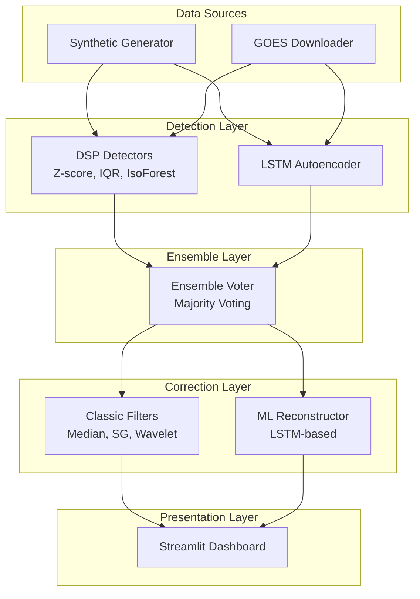

# Design Document: Cosmic Pipeline

## Overview

The Cosmic Pipeline is a hybrid DSP/ML system for detecting and correcting radiation-induced faults in satellite telemetry data. Built for the TUA Astro Hackathon 2026, it processes time-series signals corrupted by Single Event Upsets (SEU), Total Ionizing Dose (TID) drift, data gaps, and noise.

The system architecture follows a modular pipeline design with four primary stages:

1. **Data Ingestion**: Synthetic generation or GOES satellite data download
2. **Detection**: Parallel execution of DSP detectors (Z-score, IQR, Isolation Forest) and ML detector (LSTM Autoencoder)
3. **Ensemble Voting**: Majority voting across detector outputs with confidence scoring
4. **Correction**: Classic filters (median, Savitzky-Golay, wavelet) and ML reconstruction
5. **Visualization**: Interactive Streamlit dashboard with dark theme

The pipeline is designed for rapid prototyping during a 2-day hackathon, emphasizing working implementations over placeholder code, with graceful error handling and comprehensive testing.

## Architecture

### High-Level Architecture



### Module Structure

```
cosmic-pipeline/
├── data/
│   ├── synthetic_generator.py    # Synthetic telemetry with fault injection
│   └── goes_downloader.py        # NOAA SWPC API client
├── pipeline/
│   ├── detectors/
│   │   ├── dsp_detector.py       # Z-score, IQR, Isolation Forest
│   │   └── lstm_detector.py      # LSTM Autoencoder
│   ├── ensemble_voter.py         # Majority voting logic
│   ├── filters/
│   │   ├── classic_filter.py     # Median, SG, Wavelet
│   │   └── ml_reconstructor.py   # ML-based reconstruction
│   └── pipeline.py               # Orchestration
├── models/
│   ├── lstm_autoencoder.py       # PyTorch model definition
│   └── train.py                  # Training script
├── dashboard/
│   └── app.py                    # Streamlit application
├── config/
│   ├── config.py                 # Configuration dataclasses
│   └── parser.py                 # YAML/JSON parsing
├── utils/
│   ├── validation.py             # Input validation
│   ├── metrics.py                # SNR, precision, recall
│   └── logging.py                # Structured logging
└── tests/
    ├── unit/                     # Component tests
    ├── integration/              # End-to-end tests
    └── property/                 # Property-based tests
```

### Responsibility Assignment

**Ömer's Modules**:
- `data/synthetic_generator.py`
- `data/goes_downloader.py`
- `dashboard/app.py`

**Ahmet's Modules**:
- `pipeline/detectors/dsp_detector.py`
- `pipeline/detectors/lstm_detector.py`
- `pipeline/ensemble_voter.py`
- `pipeline/filters/classic_filter.py`
- `pipeline/filters/ml_reconstructor.py`

**Shared**:
- `models/` (both contribute)
- `config/` (both contribute)
- `utils/` (both contribute)
- `tests/` (both contribute)

## Components and Interfaces

### Data Layer

#### Synthetic Generator

```python
from dataclasses import dataclass
from typing import Tuple
import numpy as np

@dataclass
class FaultConfig:
    """Configuration for fault injection."""
    seu_probability: float = 0.01
    tid_drift_rate: float = 0.001
    gap_probability: float = 0.005
    gap_size_range: Tuple[int, int] = (5, 20)
    noise_snr_db: float = 20.0

class SyntheticGenerator:
    """Generates synthetic telemetry with radiation faults."""
    
    def generate(
        self,
        duration: float,
        sampling_rate: float,
        fault_config: FaultConfig
    ) -> Tuple[np.ndarray, np.ndarray, np.ndarray]:
        """
        Generate synthetic telemetry signal.
        
        Args:
            duration: Signal duration in seconds
            sampling_rate: Samples per second
            fault_config: Fault injection parameters
            
        Returns:
            Tuple of (timestamps, corrupted_signal, ground_truth_labels)
        """
        ...
```

#### GOES Downloader

```python
from dataclasses import dataclass
from typing import Optional
import pandas as pd
from datetime import datetime

@dataclass
class GOESConfig:
    """Configuration for GOES data retrieval."""
    api_url: str = "https://services.swpc.noaa.gov/json/goes/primary/"
    cache_enabled: bool = True
    timeout_seconds: int = 10

class GOESDownloader:
    """Downloads GOES satellite proton flux data."""
    
    def download(
        self,
        start_time: datetime,
        end_time: datetime,
        config: GOESConfig
    ) -> pd.DataFrame:
        """
        Download GOES proton flux data.
        
        Args:
            start_time: Start of time range
            end_time: End of time range
            config: Download configuration
            
        Returns:
            DataFrame with columns [timestamp, proton_flux]
            
        Raises:
            NetworkError: If download fails and no cache available
        """
        ...
```

### Detection Layer

#### DSP Detector

```python
from enum import Enum
from dataclasses import dataclass
import numpy as np

class DSPMethod(Enum):
    """Available DSP detection methods."""
    ZSCORE = "zscore"
    IQR = "iqr"
    ISOLATION_FOREST = "isolation_forest"

@dataclass
class DSPConfig:
    """Configuration for DSP detectors."""
    method: DSPMethod
    zscore_threshold: float = 3.0
    iqr_multiplier: float = 1.5
    iforest_contamination: float = 0.1

class DSPDetector:
    """Classic signal processing anomaly detectors."""
    
    def detect(
        self,
        signal: np.ndarray,
        config: DSPConfig
    ) -> Tuple[np.ndarray, np.ndarray]:
        """
        Detect anomalies using DSP methods.
        
        Args:
            signal: Input time-series signal
            config: Detection configuration
            
        Returns:
            Tuple of (binary_labels, anomaly_scores)
        """
        ...
```

#### LSTM Detector

```python
import torch
import torch.nn as nn
from dataclasses import dataclass
from pathlib import Path

@dataclass
class LSTMConfig:
    """Configuration for LSTM Autoencoder."""
    hidden_dim: int = 64
    num_layers: int = 2
    window_size: int = 50
    threshold_percentile: float = 95.0
    use_gpu: bool = True

class LSTMAutoencoder(nn.Module):
    """LSTM-based autoencoder for anomaly detection."""
    
    def __init__(self, input_dim: int, hidden_dim: int, num_layers: int):
        super().__init__()
        self.encoder = nn.LSTM(input_dim, hidden_dim, num_layers, batch_first=True)
        self.decoder = nn.LSTM(hidden_dim, input_dim, num_layers, batch_first=True)
    
    def forward(self, x: torch.Tensor) -> torch.Tensor:
        """Forward pass through autoencoder."""
        ...

class LSTMDetector:
    """LSTM Autoencoder-based anomaly detector."""
    
    def __init__(self, config: LSTMConfig):
        self.config = config
        self.model: Optional[LSTMAutoencoder] = None
        self.device = torch.device("cuda" if torch.cuda.is_available() and config.use_gpu else "cpu")
    
    def train(self, clean_signals: np.ndarray, epochs: int = 50) -> None:
        """Train the autoencoder on clean signals."""
        ...
    
    def detect(self, signal: np.ndarray) -> Tuple[np.ndarray, np.ndarray]:
        """Detect anomalies using reconstruction error."""
        ...
    
    def save(self, path: Path) -> None:
        """Save model weights to disk."""
        ...
    
    def load(self, path: Path) -> None:
        """Load model weights from disk."""
        ...
```

### Ensemble Layer

#### Ensemble Voter

```python
from dataclasses import dataclass
from typing import List

@dataclass
class VotingConfig:
    """Configuration for ensemble voting."""
    min_agreement: int = 2  # Minimum detectors that must agree
    weight_by_confidence: bool = True

class EnsembleVoter:
    """Combines multiple detector outputs using voting."""
    
    def vote(
        self,
        detections: List[np.ndarray],
        scores: List[np.ndarray],
        config: VotingConfig
    ) -> Tuple[np.ndarray, np.ndarray]:
        """
        Combine detector outputs via majority voting.
        
        Args:
            detections: List of binary detection arrays
            scores: List of confidence score arrays
            config: Voting configuration
            
        Returns:
            Tuple of (unified_labels, confidence_scores)
        """
        ...
```

### Correction Layer

#### Classic Filter

```python
from enum import Enum
from dataclasses import dataclass

class FilterMethod(Enum):
    """Available filtering methods."""
    MEDIAN = "median"
    SAVITZKY_GOLAY = "savitzky_golay"
    WAVELET = "wavelet"

@dataclass
class FilterConfig:
    """Configuration for classic filters."""
    method: FilterMethod
    median_window: int = 5
    sg_window: int = 11
    sg_polyorder: int = 3
    wavelet_family: str = "db4"
    wavelet_level: int = 3

class ClassicFilter:
    """Traditional signal filtering methods."""
    
    def filter(
        self,
        signal: np.ndarray,
        anomaly_mask: np.ndarray,
        config: FilterConfig
    ) -> np.ndarray:
        """
        Apply filtering to anomalous regions.
        
        Args:
            signal: Input signal
            anomaly_mask: Binary mask of anomalous regions
            config: Filter configuration
            
        Returns:
            Filtered signal
        """
        ...
```

#### ML Reconstructor

```python
@dataclass
class ReconstructorConfig:
    """Configuration for ML reconstruction."""
    confidence_threshold: float = 0.7
    blend_window: int = 5
    fallback_to_interpolation: bool = True

class MLReconstructor:
    """ML-based signal reconstruction."""
    
    def __init__(self, lstm_model: LSTMAutoencoder, config: ReconstructorConfig):
        self.model = lstm_model
        self.config = config
    
    def reconstruct(
        self,
        signal: np.ndarray,
        anomaly_mask: np.ndarray
    ) -> Tuple[np.ndarray, np.ndarray]:
        """
        Reconstruct anomalous segments using ML.
        
        Args:
            signal: Input signal
            anomaly_mask: Binary mask of anomalous regions
            
        Returns:
            Tuple of (reconstructed_signal, confidence_scores)
        """
        ...
```

### Pipeline Orchestration

```python
from dataclasses import dataclass
from typing import Dict, Any

@dataclass
class PipelineConfig:
    """Complete pipeline configuration."""
    dsp_configs: List[DSPConfig]
    lstm_config: LSTMConfig
    voting_config: VotingConfig
    filter_configs: List[FilterConfig]
    reconstructor_config: ReconstructorConfig

@dataclass
class PipelineResult:
    """Pipeline execution result."""
    cleaned_signal: np.ndarray
    anomaly_labels: np.ndarray
    confidence_scores: np.ndarray
    metrics: Dict[str, float]
    processing_time: float

class Pipeline:
    """Main pipeline orchestrator."""
    
    def __init__(self, config: PipelineConfig):
        self.config = config
        self._initialize_components()
    
    def process(
        self,
        signal: np.ndarray,
        timestamps: np.ndarray,
        ground_truth: Optional[np.ndarray] = None
    ) -> PipelineResult:
        """
        Execute complete detection and correction pipeline.
        
        Args:
            signal: Input telemetry signal
            timestamps: Corresponding timestamps
            ground_truth: Optional ground truth labels for metrics
            
        Returns:
            PipelineResult with cleaned signal and metrics
        """
        ...
```

### Configuration Management

```python
from pathlib import Path
from typing import Union
import yaml
import json

class ConfigParser:
    """Parse and format configuration files."""
    
    @staticmethod
    def parse(path: Path) -> PipelineConfig:
        """
        Parse configuration from YAML or JSON file.
        
        Args:
            path: Path to configuration file
            
        Returns:
            PipelineConfig object
            
        Raises:
            ConfigError: If file is invalid or malformed
        """
        ...
    
    @staticmethod
    def format(config: PipelineConfig, path: Path, format: str = "yaml") -> None:
        """
        Write configuration to file.
        
        Args:
            config: Configuration object
            path: Output file path
            format: Output format ("yaml" or "json")
        """
        ...
```

### Validation Utilities

```python
from typing import Optional

class ValidationError(Exception):
    """Raised when input validation fails."""
    pass

class DataValidator:
    """Input data validation."""
    
    @staticmethod
    def validate_signal(
        signal: np.ndarray,
        timestamps: Optional[np.ndarray] = None,
        min_length: int = 10
    ) -> None:
        """
        Validate input signal data.
        
        Args:
            signal: Signal array to validate
            timestamps: Optional timestamp array
            min_length: Minimum required signal length
            
        Raises:
            ValidationError: If validation fails
        """
        ...
```

### Metrics Utilities

```python
class MetricsCalculator:
    """Calculate performance metrics."""
    
    @staticmethod
    def compute_snr(clean: np.ndarray, noisy: np.ndarray) -> float:
        """Compute Signal-to-Noise Ratio in dB."""
        ...
    
    @staticmethod
    def compute_detection_metrics(
        predictions: np.ndarray,
        ground_truth: np.ndarray
    ) -> Dict[str, float]:
        """
        Compute precision, recall, F1 score.
        
        Returns:
            Dictionary with keys: precision, recall, f1_score
        """
        ...
```

## Data Models

### Core Data Structures

```python
from dataclasses import dataclass
from datetime import datetime
from typing import Optional, List
import numpy as np

@dataclass
class TelemetrySignal:
    """Represents a telemetry time-series signal."""
    timestamps: np.ndarray  # Unix timestamps or relative time
    values: np.ndarray      # Signal values
    sampling_rate: float    # Samples per second
    metadata: Dict[str, Any] = None
    
    def __post_init__(self):
        """Validate signal consistency."""
        assert len(self.timestamps) == len(self.values)
        assert self.sampling_rate > 0

@dataclass
class AnomalyDetection:
    """Represents anomaly detection results."""
    labels: np.ndarray          # Binary labels (0=normal, 1=anomaly)
    scores: np.ndarray          # Confidence scores [0, 1]
    detector_name: str          # Name of detector
    timestamp: datetime         # Detection timestamp
    
@dataclass
class CorrectionResult:
    """Represents signal correction results."""
    original_signal: np.ndarray
    cleaned_signal: np.ndarray
    anomaly_mask: np.ndarray
    confidence: np.ndarray
    method: str
    snr_improvement: float

@dataclass
class GroundTruth:
    """Ground truth labels for synthetic data."""
    anomaly_labels: np.ndarray      # Binary labels
    fault_types: np.ndarray         # Fault type codes (SEU=1, TID=2, GAP=3, NOISE=4)
    fault_locations: List[Tuple[int, int]]  # Start/end indices of faults
```

### Configuration Data Models

```python
@dataclass
class DataSourceConfig:
    """Configuration for data source selection."""
    source_type: str  # "synthetic" or "goes"
    synthetic_config: Optional[FaultConfig] = None
    goes_config: Optional[GOESConfig] = None

@dataclass
class PipelineConfig:
    """Complete pipeline configuration."""
    data_source: DataSourceConfig
    dsp_detectors: List[DSPConfig]
    lstm_detector: LSTMConfig
    ensemble_voting: VotingConfig
    classic_filters: List[FilterConfig]
    ml_reconstructor: ReconstructorConfig
    performance_targets: Dict[str, float]  # e.g., {"throughput": 1000, "max_latency": 5.0}
```

